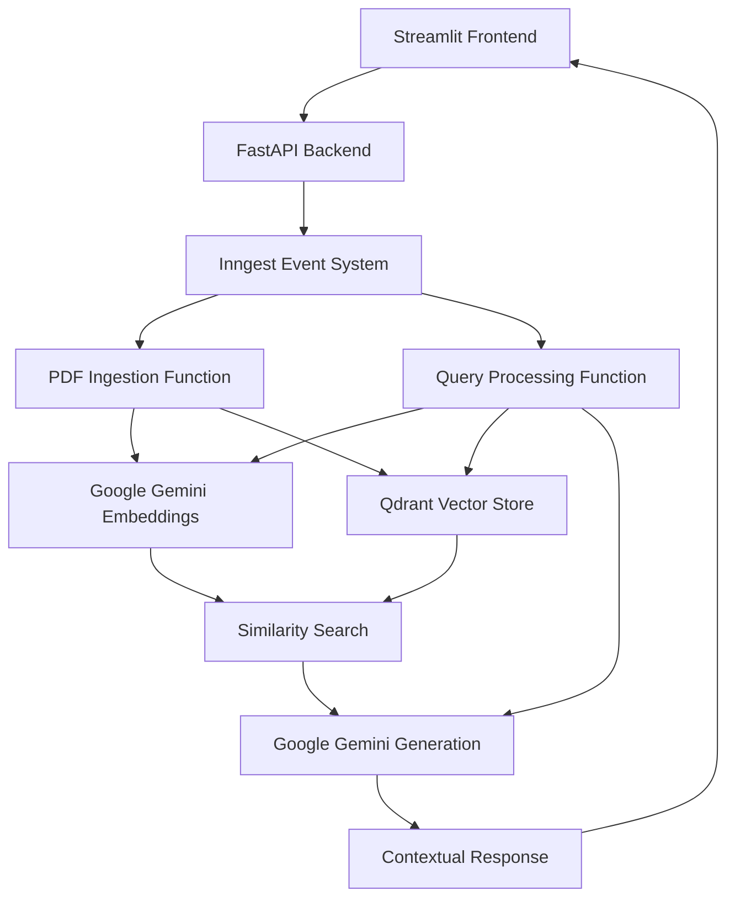

# 21-RAG-AI: Advanced Retrieval-Augmented Generation System

> **🚀 Production-ready RAG system using Google Gemini, Inngest, Qdrant, and Streamlit**

A sophisticated event-driven RAG (Retrieval-Augmented Generation) application that demonstrates modern AI integration patterns with real-time document processing, intelligent querying, and a beautiful web interface.

## 🎯 Key Features

### 🤖 AI Integration
- **Google Gemini 2.5 Flash**: Advanced LLM for intelligent responses
- **Text Embedding 004**: High-quality 768-dimensional embeddings
- **Context-Aware Responses**: Intelligent document-based Q&A
- **Event-Driven Architecture**: Scalable processing with Inngest

### 📊 Document Processing
- **PDF Ingestion**: Automatic chunking and processing
- **Vector Storage**: Qdrant vector database for similarity search
- **Semantic Search**: Advanced embedding-based retrieval
- **Source Attribution**: Track document sources for responses

### 🌐 Modern Architecture
- **FastAPI Backend**: High-performance async API
- **Streamlit Frontend**: Beautiful, responsive UI
- **Event-Driven Processing**: Inngest for scalable workflows
- **Real-time Updates**: Live processing status and results

### 🔧 Developer Experience
- **UV Package Management**: Modern Python dependency management
- **Hot Reloading**: Fast development with auto-reload
- **Type Safety**: Full type annotations with Pydantic
- **Clean Architecture**: Modular, maintainable codebase

## 🏗️ System Architecture



### 📁 Project Structure

```
21-RAG-AI/
├── main.py                 # FastAPI app + Inngest functions
├── streamlit_app.py        # Streamlit frontend
├── data_loader.py          # PDF processing & embeddings
├── vector_db.py           # Qdrant vector database
├── custom_types.py        # Pydantic models & types
├── uploads/               # PDF upload directory
├── .env.example          # Environment template
├── pyproject.toml        # Dependencies & config
└── README.md             # This file
```

## � Quick Start

### Prerequisites

- **Python 3.14+** (recommended)
- **Google Gemini API Key**
- **Docker** (for Qdrant)
- **Node.js** (for Inngest CLI)

### 1. Clone and Setup

```bash
cd 21-RAG-AI
uv sync  # Modern Python package management
```

### 2. Environment Configuration

```bash
cp .env.example .env
# Edit .env with your Google Gemini API key
```

Get your API key from [Google AI Studio](https://makersuite.google.com/app/apikey)

### 3. Start Services

**Terminal 1: Start Qdrant Vector Database**
```bash
docker run -d --name qdrant-rag -p 6333:6333 -v "$(pwd)/qdrant_storage:/qdrant/storage" qdrant/qdrant:latest
```

**Terminal 2: Start FastAPI Backend**
```bash
uv run uvicorn main:app --reload
# Server runs on http://127.0.0.1:8000
```

**Terminal 3: Start Inngest Dev Server**
```bash
npx inngest-cli@latest dev -u http://127.0.0.1:8000/api/inngest --no-discovery
# UI runs on http://127.0.0.1:8288
```

**Terminal 4: Start Streamlit Frontend**
```bash
uv run streamlit run streamlit_app.py
# UI runs on http://localhost:8501
```

## 🎮 Usage Guide

### 📄 PDF Ingestion

1. **Upload PDF**: Use the Streamlit interface to upload PDF documents
2. **Automatic Processing**: System automatically chunks, embeds, and stores content
3. **Real-time Status**: Monitor processing progress in the UI
4. **Vector Storage**: Documents are stored in Qdrant for fast retrieval

### 🔍 Intelligent Querying

1. **Ask Questions**: Type natural language questions about your documents
2. **Semantic Search**: System finds relevant document chunks using embeddings
3. **Contextual Responses**: Gemini generates answers using retrieved context
4. **Source Attribution**: See which documents provided the information

### ⚙️ Advanced Features

- **Chunk Size Control**: Adjust retrieval parameters (default: 5 chunks)
- **Real-time Processing**: Watch as documents are processed and indexed
- **Error Handling**: Comprehensive error reporting and recovery
- **Performance Monitoring**: Built-in logging and status tracking

## �️ Technical Implementation

### 🤖 Google Gemini Integration

```python
# Embedding generation
client = genai.Client()
response = client.models.embed_content(
    model="text-embedding-004",
    contents=text
)
embeddings = response.embeddings[0].values

# Text generation
response = genai_client.models.generate_content(
    model="gemini-2.5-flash",
    contents=user_content,
    config={
        "temperature": 0.2,
        "max_output_tokens": 1024,
    }
)
```

### 🔄 Event-Driven Architecture

```python
@inngest_client.create_function(
    fn_id="RAG: Query PDF",
    trigger=inngest.TriggerEvent(event="rag/query_pdf_ai"),
)
async def rag_query_pdf_ai(ctx: inngest.Context):
    # Embed question
    # Search vectors
    # Generate response
    # Return structured result
```

### 📊 Vector Database Operations

```python
# Store document chunks
store.upsert(ids, vectors, payloads)

# Semantic search
results = store.search(query_vector, top_k=5)
contexts = [r.payload["text"] for r in results.points]
```

## 🔧 Configuration

### Environment Variables

```bash
GOOGLE_API_KEY=your_gemini_api_key_here
INNGEST_API_BASE=http://127.0.0.1:8288
QDRANT_URL=http://localhost:6333
```

### System Parameters

- **Embedding Model**: `text-embedding-004` (768 dimensions)
- **Generation Model**: `gemini-2.5-flash`
- **Chunk Size**: 1000 characters with 200 overlap
- **Max Retrieval**: 5 document chunks (configurable)
- **Temperature**: 0.2 for consistent responses

## 📊 Performance & Scaling

### 🚀 Optimizations

- **Async Processing**: Non-blocking I/O throughout the stack
- **Vector Indexing**: Fast similarity search with Qdrant
- **Event Queue**: Inngest handles backpressure and retries
- **Connection Pooling**: Efficient database and API connections

### 📈 Scaling Considerations

- **Horizontal Scaling**: Multiple FastAPI workers
- **Vector Scaling**: Qdrant cluster for large document sets
- **Event Processing**: Inngest cloud for production workloads
- **Caching**: Redis for frequent queries and responses

## 🧪 Development & Testing

### 🔍 Debug Mode

```bash
# Enable verbose logging
export LOG_LEVEL=DEBUG
uv run uvicorn main:app --reload --log-level debug
```

### 🧪 Local Testing

```bash
# Test embeddings
uv run python -c "from data_loader import embed_texts; print(embed_texts(['test'])[:1])"

# Test vector database
uv run python -c "from vector_db import QdrantStorage; print(QdrantStorage())"

# Test API endpoints
curl http://localhost:8000/api/inngest
```

### 📝 Code Quality

- **Type Safety**: Full type annotations
- **Error Handling**: Comprehensive try/catch blocks
- **Logging**: Structured logging throughout
- **Documentation**: Inline docstrings and comments

## 🚀 Deployment

### 🐳 Docker Deployment

```dockerfile
FROM python:3.14-slim
WORKDIR /app
COPY pyproject.toml ./
RUN pip install uv && uv sync --frozen
COPY . .
EXPOSE 8000
CMD ["uv", "run", "uvicorn", "main:app", "--host", "0.0.0.0"]
```

### ☁️ Cloud Deployment

- **Backend**: FastAPI on AWS Lambda/ECS
- **Vector DB**: Qdrant Cloud or managed instance
- **Events**: Inngest Cloud for production
- **Frontend**: Streamlit Cloud or static hosting

## 🔒 Security Considerations

- **API Key Management**: Environment variables only
- **File Upload**: PDF validation and sandboxing
- **Input Sanitization**: Clean all user inputs
- **Rate Limiting**: Implement for production use
- **Access Control**: Add authentication as needed

## 🤝 Contributing

1. **Fork** the repository
2. **Create** a feature branch: `git checkout -b feature/amazing-feature`
3. **Commit** your changes: `git commit -m 'Add amazing feature'`
4. **Push** to the branch: `git push origin feature/amazing-feature`
5. **Open** a Pull Request

## � License

This project is licensed under the MIT License - see the [LICENSE](LICENSE) file for details.

## 🙏 Acknowledgments

- **Google** - Gemini API for embeddings and generation
- **Inngest** - Event-driven workflow platform
- **Qdrant** - High-performance vector database
- **Streamlit** - Beautiful data app framework
- **FastAPI** - Modern, fast web framework

---

## 📞 Support & Questions

**🚀 Production-ready RAG system for modern AI applications**

**📧 Open for collaboration and consulting opportunities**

**⭐ Star this repo if it helps your AI journey!**

---

> **💡 Built with modern Python, event-driven architecture, and cutting-edge AI technologies**
