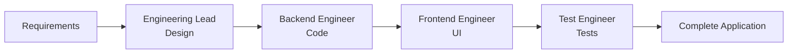

# 🏗️ 31-CrewAI-Engineering-Team

**AI Multi-Agent Software Engineering System for Complete Application Development**

---

## 🎯 **Overview**

An innovative system using **CrewAI** to orchestrate a team of specialized AI agents that collaborate to design, develop, test, and deploy complete Python applications from start to finish.

### **🚀 Key Features**

- **🤖 Specialized Multi-Agent**: 4 agents with specific roles (Engineering Lead, Backend Engineer, Frontend Engineer, Test Engineer)
- **🔄 Sequential Workflow**: Design → Code → Frontend → Tests
- **💻 Production-Ready Code**: Generates functional Python applications with Gradio UI
- **🧪 Automated Testing**: Complete unit tests generated automatically
- **⚡ Flexible Configuration**: OpenAI models optimized per task

---

## 🏛️ **System Architecture**

### **🤖 Specialized Agents**

| Agent | OpenAI Model | Specific Role | Responsibilities |
|--------|--------------|---------------|-------------------|
| **Engineering Lead** | `gpt-4-turbo` | Architectural Design | - Detailed system design<br>- Class and method architecture<br>- Technical specifications |
| **Backend Engineer** | `gpt-4o` | Python Development | - Backend implementation<br>- Business logic<br>- Data structure |
| **Frontend Engineer** | `gpt-4o` | User Interface | - Complete Gradio UI<br>- Backend integration<br>- User experience |
| **Test Engineer** | `gpt-4o-mini` | Quality Assurance | - Unit tests<br>- Functional validation<br>- Code coverage |

### **🔄 Workflow**



---

## 🛠️ **Installation and Setup**

### **📋 Prerequisites**

- Python 3.12+
- OpenAI API Key
- Git

### **⚙️ Environment Setup**

```bash
# Clone the repository
git clone <repository-url>
cd 31-crewai_engineering_team

# Create virtual environment
python3 -m venv .venv
source .venv/bin/activate  # macOS/Linux
# or .venv\Scripts\activate  # Windows

# Install dependencies
pip install -r requirements.txt
```

### **🔑 Environment Variables**

Create `.env` file:
```bash
OPENAI_API_KEY=your_openai_api_key_here
CREWAI_TRACING_ENABLED=true  # Optional: for tracing
```

---

## 🚀 **System Usage**

### **🎯 Basic Execution**

```bash
# Run the complete engineering team
crewai run
```

### **📝 Project Customization**

Edit `src/crewai_engineering_team/main.py`:

```python
# Define project requirements
requirements = """
[Describe your application here]
- Feature 1
- Feature 2
- Specific requirements
"""

module_name = "your_module.py"
class_name = "YourClass"

# The system will automatically generate:
# - Architectural design
# - Complete backend code
# - Gradio interface
# - Unit tests
```

---

## 📁 **Project Structure**

```
31-crewai_engineering_team/
├── 📄 README.md                    # This file
├── 📄 requirements.txt             # Python dependencies
├── 📄 .env.example                 # Environment variables template
├── 📁 src/crewai_engineering_team/
│   ├── 📄 main.py                  # Main entry point
│   ├── 📄 crew.py                  # Agents and tasks configuration
│   └── 📁 config/
│       ├── 📄 agents.yaml          # Agents configuration
│       └── 📄 tasks.yaml           # Tasks configuration
└── 📁 output/                      # Generated results
    ├── 📄 accounts.py              # Generated backend
    ├── 📄 app.py                   # Gradio frontend
    └── 📄 test_accounts.py         # Unit tests
```

---

## 💡 **Usage Example: Trading System**

### **🎯 Input Requirements**

```python
requirements = """
A simple account management system for a trading simulation platform.
The system should allow users to create an account, deposit funds, and withdraw funds.
The system should allow users to record that they have bought or sold shares, providing a quantity.
The system should calculate the total value of the user's portfolio, and the profit or loss from the initial deposit.
The system should be able to report the holdings of the user at any point in time.
The system should be able to report the profit or loss of the user at any point in time.
The system should be able to list the transactions that the user has made over time.
The system should prevent the user from withdrawing funds that would leave them with a negative balance, or
 from buying more shares than they can afford, or selling shares that they don't have.
 The system has access to a function get_share_price(symbol) which returns the current price of a share, and includes a test implementation that returns fixed prices for AAPL, TSLA, GOOGL.
"""
```

### **🏗️ Generated Results**

**1. Backend (`accounts.py`)**
```python
class Account:
    def __init__(self, username, initial_deposit):
        # Complete initialization
    
    def deposit(self, amount):
        # Deposits with validation
    
    def buy_shares(self, symbol, quantity):
        # Stock purchases
    
    def calculate_total_value(self):
        # Portfolio value calculation
```

**2. Frontend (`app.py`)**
- Gradio interface with 8 functional tabs
- Account creation, deposits, withdrawals
- Buy/sell stocks
- Real-time reports

**3. Tests (`test_accounts.py`)**
- 17 complete unit tests
- 100% feature coverage
- Edge case validation

---

## 🎛️ **Advanced Configuration**

### **⚡ Model Optimization**

Current configuration optimizes cost vs quality:

```yaml
# High quality for critical design
engineering_lead: gpt-4-turbo

# Quality/cost balance for development
backend_engineer: gpt-4o
frontend_engineer: gpt-4o

# Economical for repetitive tests
test_engineer: gpt-4o-mini
```

### **🔧 Execution Parameters**

```python
# In crew.py - Timeout configuration
allow_code_execution=True
code_execution_mode="safe"
max_execution_time=240  # seconds
max_retries=5
```

---

## 🧪 **Testing and Validation**

### **✅ Run Generated Tests**

```bash
cd output/
python3 test_accounts.py -v
```

**Expected results:**
```
Ran 17 tests in 0.001s
OK
```

### **🎯 Test Complete Application**

```bash
cd output/
python3 app.py
```

Open `http://localhost:7860` to use the Gradio interface.

---

## 📊 **Performance Metrics**

### **⏱️ Typical Execution Times**

| Task | Agent | Average Time |
|------|--------|--------------|
| Design | Engineering Lead | 30-60 seconds |
| Code | Backend Engineer | 60-120 seconds |
| Frontend | Frontend Engineer | 45-90 seconds |
| Tests | Test Engineer | 60-180 seconds |
| **Total** | **Complete Crew** | **3-8 minutes** |

### **💰 Estimated Costs (OpenAI)**

- **Complete execution**: ~$0.50-1.50 USD
- **Per project**: Depends on complexity
- **Optimization**: Balanced models for efficiency

---

## 🚨 **Troubleshooting**

### **⚠️ Common Issues**

**1. Task Timeouts**
```bash
# Increase timeout in crew.py
max_execution_time=300  # 5 minutes
```

**2. Failed Tests**
```bash
# Verify business logic in requirements
# Ensure validation consistency
```

**3. API Key Error**
```bash
# Check .env file
export OPENAI_API_KEY="your_key"
```

---

## 🎯 **Recommended Use Cases**

### **🏦 Financial Applications**
- Trading systems
- Portfolio management
- Investment simulators

### **🛒 E-commerce**
- Inventory management
- Payment systems
- Shopping carts

### **📊 Data Dashboards**
- Interactive visualizations
- Automated reports
- Data analysis

### **🎮 Games and Simulations**
- Strategy games
- Business simulators
- Scoring systems

---

## 🔮 **Future Roadmap**

### **🚀 Upcoming Features**

- [ ] **Database Integration**: PostgreSQL, MongoDB
- [ ] **Automated Deployment**: Docker, Cloud deployment
- [ ] **More Frameworks**: FastAPI, Django, Flask
- [ ] **Advanced Testing**: Integration tests, E2E tests
- [ ] **CI/CD Integration**: GitHub Actions, GitLab CI
- [ ] **Multi-language Support**: JavaScript, Java, C++

### **🎯 Planned Improvements**

- **Specialized Agents**: DevOps Engineer, Security Engineer
- **Predefined Templates**: E-commerce, FinTech, Healthcare
- **Performance Optimization**: Caching, async processing
- **Enterprise Features**: Role-based access, audit logs

---

## 🤝 **Contributions**

### **🛠️ How to Contribute**

1. **Fork** the repository
2. **Create** feature branch: `git checkout -b feature/amazing-feature`
3. **Commit** changes: `git commit -m 'Add amazing feature'`
4. **Push** to branch: `git push origin feature/amazing-feature`
5. **Open** Pull Request

### **📋 Contribution Areas**

- **New Agents**: Domain-specific specialists
- **UI Improvements**: Interface templates
- **Integrations**: External APIs, databases
- **Documentation**: Guides, tutorials, examples
- **Testing**: Test cases, benchmarks

---

## 📄 **License**

This project is licensed under the **MIT License** - see [LICENSE](LICENSE) file for details.

---

## 🙏 **Acknowledgments**

- **CrewAI Framework**: For multi-agent infrastructure
- **OpenAI**: For advanced language models
- **Gradio**: For fast user interface
- **Community**: For feedback and contributions

---

## 📞 **Contact and Support**

- **Issues**: [GitHub Issues](https://github.com/your-repo/issues)
- **Discussions**: [GitHub Discussions](https://github.com/your-repo/discussions)
- **Email**: your-email@example.com

---

## 🏆 **Conclusion**

**31-CrewAI-Engineering-Team** represents the future of automated software development, combining AI power with human expertise to create complete applications efficiently and scalably.

**🚀 Transform your ideas into production-ready code in minutes, not days!**

---

*Last updated: January 2026*