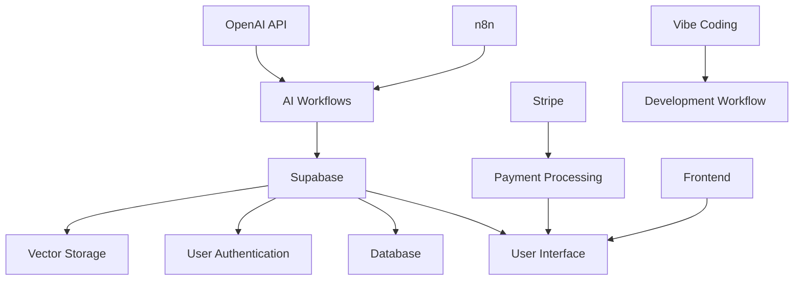
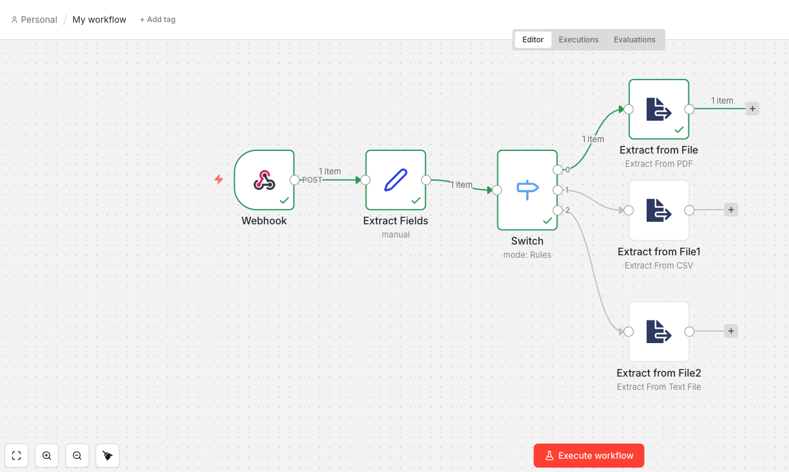

# AI-Powered Full-Stack Applications

A comprehensive full-stack AI application demonstrating real-world integration of OpenAI, Supabase, n8n, Stripe, and modern automation tools. This project showcases the complete development workflow from AI integration to production deployment.

## 🎯 Project Overview

**Project:** AI-Powered Full-Stack Application with Modern Automation Tools  
**Technologies:** OpenAI, Supabase, n8n, Stripe, VibeCoding Workflow  
**Status:** Active Development  
**Last Updated:** February 2026  

## 🚀 What This Project Demonstrates

This project showcases the complete implementation of a production-ready AI application:

- **Full-Stack AI Integration**: End-to-end application with OpenAI, Supabase, and n8n
- **Automation Workflows**: Intelligent workflows that integrate AI agents and real-time data
- **Vector Storage & RAG**: Advanced embedding storage and retrieval with Supabase
- **User Management**: Complete authentication, user limits, and Stripe payment integration
- **Production Deployment**: Fully deployed application with monitoring and analytics

## 🏗️ Project Architecture

### Technology Stack



### Core Components

- **AI Integration**: OpenAI API for intelligent processing
- **Workflow Automation**: n8n for connecting services and data flows
- **Database & Storage**: Supabase for vector storage, authentication, and real-time data
- **Payment System**: Stripe integration for subscription management
- **Frontend**: Modern UI with real-time chat and transcript-driven interfaces
- **Deployment**: Production-ready deployment strategies

## ️ Features & Capabilities

### AI-Powered Workflows


**Core Features:**

- 🤖 **AI Agent Integration**: Connect multiple AI agents for complex tasks
- 🔄 **Real-Time Data Processing**: Process and analyze data in real-time
- 💾 **Vector Storage**: Advanced RAG implementation with Supabase
- 🔐 **User Authentication**: Secure user management with Supabase Auth
- 💳 **Payment Processing**: Complete Stripe integration for subscriptions
- 📊 **Analytics & Monitoring**: Track usage and performance metrics

## 🚀 Getting Started

### Prerequisites

- Basic understanding of APIs (helpful but not required)
- Familiarity with JavaScript or any programming language (plus but not required)
- No prior AI, OpenAI, or n8n experience needed
- Willingness to learn by building real-world projects

### Installation

1. **Clone the repository**

   ```bash
   git clone https://github.com/yourusername/47-OpenAI-Supabase-Integration.git
   cd 47-OpenAI-Supabase-Integration
   ```

2. **Install dependencies**

   ```bash
   npm install
   ```

3. **Set up environment variables**

   ```bash
   cp .env.example .env
   # Edit .env with your API keys and configurations
   ```

4. **Start the development environment**

   ```bash
   npm run dev
   ```

### Environment Configuration

Create a `.env` file with the following variables:

```env
# OpenAI Configuration
OPENAI_API_KEY=your_openai_api_key_here

# Supabase Configuration
SUPABASE_URL=your_supabase_project_url
SUPABASE_ANON_KEY=your_supabase_anon_key
SUPABASE_SERVICE_ROLE_KEY=your_supabase_service_role_key

# Stripe Configuration
STRIPE_SECRET_KEY=your_stripe_secret_key
STRIPE_PUBLISHABLE_KEY=your_stripe_publishable_key
STRIPE_WEBHOOK_SECRET=your_stripe_webhook_secret

# n8n Configuration
N8N_WEBHOOK_URL=your_n8n_webhook_url
N8N_API_KEY=your_n8n_api_key

# Application Settings
NODE_ENV=development
PORT=3000
FRONTEND_URL=http://localhost:3000
```

## 📚 Implementation Roadmap

### Phase 1: Foundation & Setup

- OpenAI and n8n workflow configuration
- Supabase database setup and authentication
- Basic AI integration and API connections

### Phase 2: Core Features

- Vector storage implementation for RAG
- Real-time chat interface development
- User management and authentication system

### Phase 3: Advanced Integration

- Stripe payment processing and subscription management
- Advanced automation workflows
- Real-time data processing and analytics

### Phase 4: Production Deployment

- Docker containerization and deployment
- CI/CD pipeline setup
- Monitoring, analytics, and performance optimization

## 🎯 Use Cases

### For Developers

- Build AI-powered SaaS applications
- Implement advanced search with RAG
- Create subscription-based AI services

### For Entrepreneurs

- Launch AI products quickly
- Automate business processes
- Scale with user management systems

### For Automation Enthusiasts

- Connect multiple AI services
- Build intelligent workflows
- Process data automatically

## 🔧 Advanced Features

The project will implement advanced features including:

- **Vector Search & RAG**: Advanced embedding storage and retrieval with Supabase
- **Real-Time Chat**: AI-enhanced conversations with message history and context
- **Stripe Payments**: Complete payment processing with subscription management
- **Automation Workflows**: Intelligent n8n workflows for data processing

## 🚀 Deployment

The project will be deployed using modern containerization and CI/CD practices:

- **Development Environment**: Local development with Docker Compose
- **Production Deployment**: Cloud deployment with automated pipelines
- **Monitoring**: Real-time analytics and performance tracking
- **Scaling**: Horizontal scaling capabilities for production use

## 📊 Monitoring & Analytics

### Key Metrics

- API response times
- User engagement rates
- Conversion funnels
- Revenue tracking
- Error rates and performance

### Monitoring Tools

- Supabase Dashboard
- Stripe Dashboard
- Custom analytics dashboard
- Error tracking services

## 🤝 Contributing

1. Fork the repository
2. Create a feature branch (`git checkout -b feature/amazing-feature`)
3. Commit your changes (`git commit -m 'Add amazing feature'`)
4. Push to the branch (`git push origin feature/amazing-feature`)
5. Open a Pull Request

## � Workflow Example

Here's a visual representation of our AI-powered workflow architecture:



This workflow demonstrates how OpenAI, Supabase, n8n, and Stripe integrate to create a seamless AI-powered full-stack application.

---

**Tags:** #AI #FullStack #OpenAI #Supabase #Stripe #n8n #VibeCoding #WebDevelopment #MachineLearning #Project