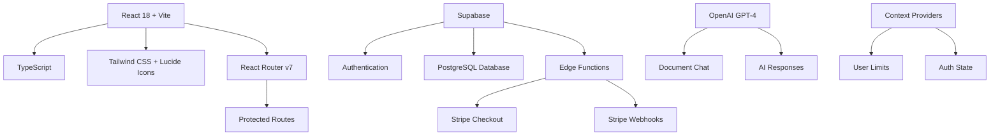
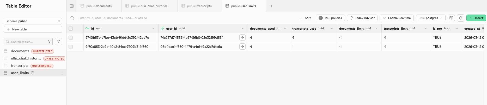

# 🤖 DocuChat AI - AI-Powered Document & Video Assistant

A production-ready full-stack AI application featuring document chat, YouTube transcript extraction, and subscription management. Built with React, TypeScript, Supabase, OpenAI, and Stripe.

## 🎯 Project Overview

**Project:** DocuChat AI - Intelligent Document & Video Processing Platform  
**Technologies:** React 18, TypeScript, Vite, Supabase, OpenAI, Stripe, Tailwind CSS  
**Status:** Production Ready ✅  
**Live Demo:** [https://python-projects-rose.vercel.app/login](https://python-projects-rose.vercel.app/login)  
**Last Updated:** March 2026  
**Version:** 2.0.0

## 🚀 What This Project Demonstrates

This project showcases a complete production-ready AI SaaS application:

- **🤖 AI-Powered Chat**: Interactive document Q&A with OpenAI GPT-4
- **📄 Document Processing**: Upload and chat with PDF, TXT, and CSV files
- **🎥 YouTube Integration**: Extract and analyze video transcripts
- **💳 Stripe Payments**: Complete subscription system with Pro tier upgrades
- **👤 User Management**: Authentication, usage limits, and tier-based access control
- **⚡ Modern Stack**: React 18, TypeScript, Vite, Supabase Edge Functions
- **🎨 Beautiful UI**: Responsive design with Tailwind CSS and Lucide icons
- **🔒 Secure**: JWT authentication, RLS policies, and webhook signature verification

## 🏗️ Project Architecture

### Technology Stack



### Core Components

**Frontend:**
- **Framework**: React 18 with Vite for blazing-fast development
- **Routing**: React Router v7 with protected routes
- **UI/UX**: Tailwind CSS with custom design system and dark mode
- **Icons**: Lucide React for beautiful, consistent icons
- **Type Safety**: 100% TypeScript with strict mode enabled

**Backend:**
- **Database**: Supabase PostgreSQL with Row Level Security (RLS)
- **Authentication**: Supabase Auth with JWT tokens and session management
- **Edge Functions**: Deno-based serverless functions for Stripe integration
- **Storage**: Document metadata and user limits tracking

**Integrations:**
- **AI**: OpenAI GPT-4 for intelligent document Q&A
- **Payments**: Stripe Checkout and webhook processing
- **Video**: YouTube transcript extraction via RapidAPI

## 🛠️ Features & Capabilities

### 1. 📄 Document Chat System

**Core Features:**

- 📁 **File Upload**: Drag & drop interface for PDF, TXT, and CSV files
- 💬 **AI Chat**: Ask questions about your documents with GPT-4
- � **Usage Tracking**: Monitor document uploads with visual limits
- � **User Limits**: Free tier (3 documents) and Pro tier (unlimited)
- 📝 **Markdown Support**: Rich formatting in AI responses
- 🗂️ **Document History**: View all uploaded documents with metadata
- ❌ **Smart Validation**: File type and size validation (max 10MB)
- 🎨 **Beautiful UI**: Modern, responsive design with loading states

**Technical Implementation:**
- Real-time limit checking before uploads
- Automatic user ID tracking
- Document metadata storage in Supabase
- Error handling with user-friendly messages
- Upgrade prompts when limits are reached

### 2. 🎥 YouTube Transcript Extractor

**Core Features:**

- 🔗 **URL Input**: Extract transcripts from any YouTube video
- ⚡ **Fast Extraction**: Instant transcript retrieval via RapidAPI
- 📋 **Copy to Clipboard**: One-click transcript copying
- 💾 **Download as TXT**: Save transcripts locally
- ✅ **URL Validation**: Smart YouTube URL format detection
- 📊 **Usage Limits**: Free tier (3 transcripts) and Pro tier (unlimited)
- 🔒 **User Tracking**: All extractions tied to authenticated users
- 📈 **Statistics**: Line count and character count display

**Technical Implementation:**
- YouTube URL parsing and validation
- RapidAPI integration for transcript fetching
- Usage limit enforcement with upgrade prompts
- Clipboard API integration
- File download generation

### 3. 💳 Subscription & Payment System

**Core Features:**

- � **Stripe Integration**: Secure payment processing with Stripe Checkout
- 🎯 **Pro Tier**: $9/month subscription with unlimited access
- 🔄 **Auto-Renewal**: Automatic subscription management
- 📧 **Webhook Processing**: Real-time subscription status updates
- 🔒 **Secure**: JWT authentication and webhook signature verification
- � **Subscription Tracking**: End date, status, and customer ID storage
- ✅ **Payment Success**: Dedicated success and cancel pages
- � **Instant Upgrade**: Immediate limit updates after payment

**Technical Implementation:**
- Supabase Edge Functions for Stripe integration
- Webhook handling for subscription events
- Database updates on payment completion
- Customer creation and tracking
- Subscription end date management

### 4. 👤 User Management & Authentication

**Core Features:**

- 🔐 **Secure Auth**: Supabase authentication with email/password
- 👥 **User Profiles**: Profile management with avatar support
- � **Protected Routes**: Route guards for authenticated pages
- 📊 **Usage Limits**: Real-time limit tracking and enforcement
- � **Session Management**: Automatic token refresh and state sync
- � **Logout**: Clean session termination
- ✅ **Email Verification**: Optional email confirmation

**Technical Implementation:**
- Context-based auth state management
- Automatic limit reloading on login/logout
- JWT token handling
- Row Level Security (RLS) policies
- User limits table with Stripe fields

### Technical Implementation

**File Upload Payload:**

```json
{
  "data": "<File Blob>",
  "filename": "document.pdf",
  "fileType": "application/pdf",
  "fileSize": "2621440",
  "timestamp": "2026-03-05T00:32:15.123Z",
  "userId": "actual-supabase-user-id"
}
```

**Chat Message Payload:**

```json
{
  "chatInput": "Tell me about LLMs and agents",
  "sessionId": "ABC123DEF456",
  "userId": "actual-supabase-user-id"
}
```

**YouTube Transcript Payload:**

```json
{
  "userId": "actual-supabase-user-id",
  "videoUrl": "https://www.youtube.com/watch?v=dQw4w9WgXcQ"
}
```

**Error Handling:**

- Server error parsing (JSON and text responses)
- HTTP status code display
- User-friendly error messages
- Retry capabilities
- URL validation for YouTube links

## 🚀 Getting Started

### Prerequisites

- Node.js 18+ and npm 8+
- OpenAI API key
- Supabase project
- n8n instance
- Stripe account (optional)

### Installation

1. **Clone the repository**

   ```bash
   git clone https://github.com/yourusername/47-OpenAI-Supabase-Integration.git
   cd 47-OpenAI-Supabase-Integration
   ```

2. **Install dependencies**

   ```bash
   npm install
   ```

3. **Set up environment variables**

   ```bash
   cp .env.example .env
   # Edit .env with your API keys and configurations
   ```

4. **Start the development environment**

   ```bash
   npm run dev
   ```

### Environment Configuration

Create a `.env` file with the following variables:

```env
# Supabase Configuration
VITE_SUPABASE_URL=https://your-project.supabase.co
VITE_SUPABASE_ANON_KEY=your_supabase_anon_key

# Supabase Edge Functions (Server-side)
SUPABASE_URL=https://your-project.supabase.co
SUPABASE_SERVICE_ROLE_KEY=your_service_role_key
STRIPE_SECRET_KEY=sk_test_your_stripe_secret_key
STRIPE_WEBHOOK_SECRET=whsec_your_webhook_secret

# OpenAI Configuration
VITE_OPENAI_API_KEY=your_openai_api_key

# n8n Webhook URLs
VITE_N8N_UPLOAD_WEBHOOK_URL=your_n8n_file_upload_webhook_url
VITE_N8N_CHAT_WEBHOOK_URL=your_n8n_chat_webhook_url
VITE_N8N_YOUTUBE_WEBHOOK_URL=your_n8n_youtube_webhook_url

# RapidAPI (YouTube Transcripts)
VITE_RAPIDAPI_KEY=your_rapidapi_key
VITE_RAPIDAPI_HOST=youtube-transcriptor.p.rapidapi.com

# Application Settings
VITE_APP_URL=http://localhost:5173
```

## 📁 Project Structure

```text
47-OpenAI-Supabase-Integration/
├── src/
│   ├── components/
│   │   ├── FileUpload/           # Document upload component
│   │   ├── Chat/                 # AI chat interface
│   │   ├── Modals/               # Upgrade and limit modals
│   │   ├── Layout/               # Header, sidebar, navigation
│   │   └── LimitReached/         # Limit notification component
│   ├── pages/
│   │   ├── ChatPage.tsx          # Main chat interface
│   │   ├── TranscriptPage.tsx    # YouTube transcript extractor
│   │   ├── HistoryPage.tsx       # Document history
│   │   ├── PaymentSuccessPage.tsx # Payment success
│   │   └── PaymentCancelPage.tsx  # Payment cancel
│   ├── contexts/
│   │   ├── AuthContext.tsx       # Authentication state
│   │   └── UserLimitsContext.tsx # Usage limits management
│   ├── services/
│   │   ├── stripe.service.ts     # Stripe payment service
│   │   ├── openai.service.ts     # OpenAI integration
│   │   ├── youtube.service.ts    # YouTube API service
│   │   └── document.service.ts   # Document operations
│   ├── hooks/
│   │   ├── useAuth.ts            # Authentication hook
│   │   ├── useUserLimits.ts      # Usage limits hook
│   │   └── useProtectedRoute.ts  # Route protection
│   ├── types/
│   │   ├── auth.types.ts         # Auth type definitions
│   │   ├── limits.types.ts       # Limits type definitions
│   │   └── document.types.ts     # Document type definitions
│   ├── utils/
│   │   ├── formatters.ts         # Data formatting utilities
│   │   └── validators.ts         # Input validation
│   ├── config/
│   │   └── limits.ts             # Usage limit constants
│   └── lib/
│       └── supabase.ts           # Supabase client
├── supabase/
│   ├── functions/
│   │   ├── create-checkout-session/  # Stripe checkout
│   │   └── stripe-webhook/           # Webhook handler
│   └── migrations/
│       ├── 20240311_create_user_limits_table.sql
│       └── 20240312_add_stripe_fields.sql
├── docs/
│   ├── STRIPE_SETUP.md           # Stripe integration guide
│   └── ARCHITECTURE.md           # System architecture
├── assets/                       # Screenshots and diagrams
├── package.json                  # Dependencies
├── tailwind.config.js            # Tailwind configuration
├── tsconfig.json                 # TypeScript configuration
└── README.md                     # This file
```

## 🔧 Technical Implementation

### Database Schema

**user_limits table:**

```sql
CREATE TABLE user_limits (
  id UUID PRIMARY KEY DEFAULT uuid_generate_v4(),
  user_id UUID REFERENCES auth.users NOT NULL UNIQUE,
  documents_used INTEGER DEFAULT 0,
  transcripts_used INTEGER DEFAULT 0,
  documents_limit INTEGER DEFAULT 3,
  transcripts_limit INTEGER DEFAULT 3,
  is_pro BOOLEAN DEFAULT false,
  stripe_customer_id TEXT,
  stripe_subscription_id TEXT,
  subscription_status TEXT DEFAULT 'inactive',
  subscription_end_date TIMESTAMPTZ,
  created_at TIMESTAMPTZ DEFAULT NOW(),
  updated_at TIMESTAMPTZ DEFAULT NOW()
);
```

**documents table:**

```sql
CREATE TABLE documents (
  id UUID PRIMARY KEY DEFAULT uuid_generate_v4(),
  user_id UUID REFERENCES auth.users NOT NULL,
  filename TEXT NOT NULL,
  file_type TEXT,
  file_size INTEGER,
  upload_date TIMESTAMPTZ DEFAULT NOW(),
  status TEXT DEFAULT 'uploaded'
);
```

### Supabase Edge Functions

**create-checkout-session:**
- Creates Stripe Checkout session
- Manages customer creation
- Handles authentication with JWT
- Returns checkout URL for redirect

**stripe-webhook:**
- Processes Stripe webhook events
- Updates subscription status
- Manages user tier upgrades/downgrades
- Handles payment failures

**Core Functions:**

```typescript
// File validation
const validateFile = (file: File): string | null => {
  const extension = '.' + file.name.split('.').pop()?.toLowerCase();
  if (!ALLOWED_TYPES.includes(extension)) {
    return `Invalid file type. Allowed types: ${ALLOWED_TYPES.join(', ')}`;
  }
  if (file.size > MAX_FILE_SIZE) {
    return `File size exceeds 10MB limit`;
  }
  return null;
};

// Upload with error handling
const uploadFile = async (uploadedFile: UploadedFile) => {
  try {
    const formData = new FormData();
    formData.append('data', uploadedFile.file);
    formData.append('filename', uploadedFile.file.name);
    formData.append('fileType', uploadedFile.file.type);
    formData.append('fileSize', uploadedFile.file.size.toString());
    formData.append('timestamp', new Date().toISOString());
    formData.append('userId', 'USR' + Math.random().toString(36).substr(2, 9).toUpperCase());

    const response = await fetch(N8N_UPLOAD_WEBHOOK_URL, {
      method: 'POST',
      body: formData,
    });

    if (!response.ok) {
      // Advanced error parsing
      let errorMessage = `Upload failed (${response.status} ${response.statusText})`;
      
      try {
        const errorData = await response.json();
        if (errorData.message) {
          errorMessage = `Error ${response.status}: ${errorData.message}`;
        }
      } catch {
        // Fallback to text
        const errorText = await response.text();
        if (errorText) {
          errorMessage = `Error ${response.status}: ${errorText}`;
        }
      }
      
      throw new Error(errorMessage);
    }
  } catch (error) {
    // Handle and display errors
  }
};
```

### TypeScript Configuration

**Environment Types:**

```typescript
// src/vite-env.d.ts
interface ImportMetaEnv {
  readonly VITE_SUPABASE_URL: string
  readonly VITE_SUPABASE_ANON_KEY: string
  readonly VITE_OPENAI_API_KEY: string
  readonly VITE_STRIPE_PUBLISHABLE_KEY: string
  readonly VITE_N8N_UPLOAD_WEBHOOK_URL: string
  readonly VITE_APP_URL: string
}

interface ImportMeta {
  readonly env: ImportMetaEnv
}
```

**Custom Types:**

```typescript
// src/types/index.ts
export interface UploadedFile {
  file: File
  id: string
  status: 'idle' | 'uploading' | 'success' | 'error'
  error?: string
}

export interface User {
  id: string
  email: string
  full_name: string | null
  avatar_url: string | null
  stripe_customer_id: string | null
  subscription_tier: 'free' | 'pro' | 'enterprise'
  created_at: string
  updated_at: string
}
```

## 📚 Implementation Roadmap

### Phase 1: Foundation & Setup ✅ COMPLETED

- ✅ Next.js 14 with TypeScript setup
- ✅ Tailwind CSS configuration
- ✅ Environment variable management
- ✅ Project structure and organization

### Phase 2: Core Features ✅ COMPLETED

- ✅ Advanced File Uploader component
- ✅ n8n webhook integration
- ✅ Error handling and user feedback
- ✅ TypeScript type safety
- ✅ Responsive design implementation

### Phase 3: Advanced Integration ✅ COMPLETED

- ✅ Supabase authentication system
- ✅ OpenAI API integration
- ✅ Real-time chat interface
- ✅ Stripe payment processing
- ✅ YouTube transcript extraction
- ✅ Usage limits and tier management

### Phase 4: Production Features ✅ COMPLETED

- ✅ Stripe webhooks for subscription management
- ✅ Edge Functions deployment
- ✅ User limit tracking and enforcement
- ✅ Payment success/cancel pages
- ✅ Automatic session management
- ✅ Database migrations

## 🎯 Use Cases

### For Developers

- Build AI-powered SaaS applications with file processing
- Implement advanced upload systems with workflow integration
- Create subscription-based AI services with file handling

### For Entrepreneurs

- Launch AI products with document processing capabilities
- Automate business processes with n8n workflows
- Scale with user management and subscription systems

### For Automation Enthusiasts

- Connect multiple AI services through n8n
- Build intelligent file processing workflows
- Process data automatically with real-time feedback

## 🚀 Deployment

### Development Environment

```bash
# Install dependencies
npm install

# Start the development server
npm run dev

# Access the application
# Frontend: http://localhost:5173
```

### Supabase Setup

1. **Create Supabase project** at https://supabase.com

2. **Run database migrations:**
   ```bash
   # Install Supabase CLI
   brew install supabase/tap/supabase
   
   # Link project
   supabase link --project-ref your-project-ref
   
   # Push migrations
   supabase db push
   ```

3. **Deploy Edge Functions:**
   ```bash
   # Deploy checkout function
   supabase functions deploy create-checkout-session
   
   # Deploy webhook function
   supabase functions deploy stripe-webhook
   ```

4. **Set secrets:**
   ```bash
   supabase secrets set STRIPE_SECRET_KEY=sk_test_...
   supabase secrets set STRIPE_WEBHOOK_SECRET=whsec_...
   ```

### Stripe Setup

1. Create Stripe account at https://stripe.com
2. Get API keys from Dashboard > Developers > API keys
3. Create webhook endpoint:
   - URL: `https://your-project.supabase.co/functions/v1/stripe-webhook`
   - Events: `checkout.session.completed`, `customer.subscription.updated`, `customer.subscription.deleted`, `invoice.payment_failed`
4. Copy webhook signing secret

### Production Deployment

**Frontend (Vercel/Netlify):**
```bash
# Build for production
npm run build

# Preview production build
npm run preview
```

**Environment Variables:**
- Set all `VITE_*` variables in your hosting platform
- Use production Supabase and Stripe keys
- Update webhook URLs to production endpoints

## 📊 Monitoring & Analytics

### Key Metrics

- File upload success rates
- Processing time analytics
- User engagement tracking
- Error rate monitoring
- Performance metrics

### Monitoring Tools

- Custom error tracking in FileUploader
- n8n workflow monitoring
- Supabase dashboard
- Stripe analytics

## 🤝 Contributing

1. Fork the repository
2. Create a feature branch (`git checkout -b feature/amazing-feature`)
3. Commit your changes (`git commit -m 'Add amazing feature'`)
4. Push to the branch (`git push origin feature/amazing-feature`)
5. Open a Pull Request

## 📋 Workflow Example

Here's a visual representation of our file processing workflow:




This workflow demonstrates how files are uploaded, processed through n8n, and integrated with AI services for a seamless user experience.

---

## 📊 Key Metrics

- **Tech Stack**: React 18, TypeScript, Vite, Supabase, Stripe, OpenAI
- **Components**: 24+ React components
- **Edge Functions**: 2 Deno serverless functions
- **Database Tables**: 2 main tables with RLS policies
- **API Integrations**: 3 (OpenAI, Stripe, RapidAPI)
- **Authentication**: JWT-based with automatic session refresh
- **Payment Processing**: Stripe Checkout with webhook handling

## 🔐 Security Features

- ✅ Row Level Security (RLS) on all database tables
- ✅ JWT authentication with automatic token refresh
- ✅ Stripe webhook signature verification
- ✅ Environment variable protection
- ✅ Protected routes with auth guards
- ✅ Input validation and sanitization
- ✅ Secure Edge Functions with manual auth handling

## 📝 License

MIT License - feel free to use this project for learning and commercial purposes.

---

**Built with ❤️ using React, TypeScript, Supabase, and Stripe**

**Tags:** #AI #React #TypeScript #Supabase #Stripe #OpenAI #SaaS #FullStack #WebDevelopment #EdgeFunctions #TailwindCSS #Vite
