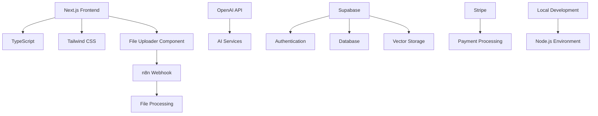
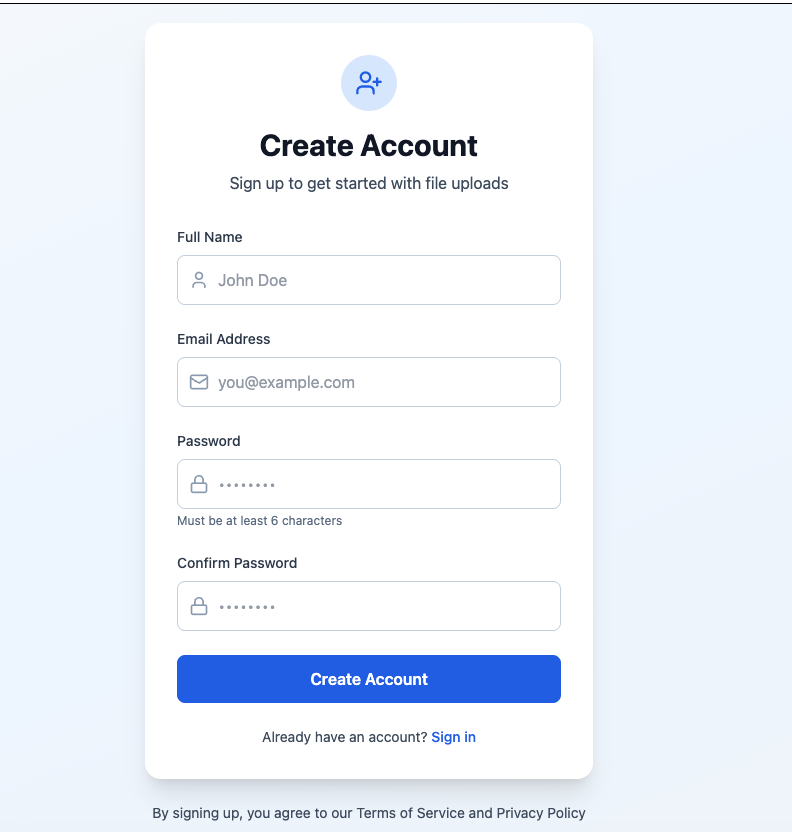
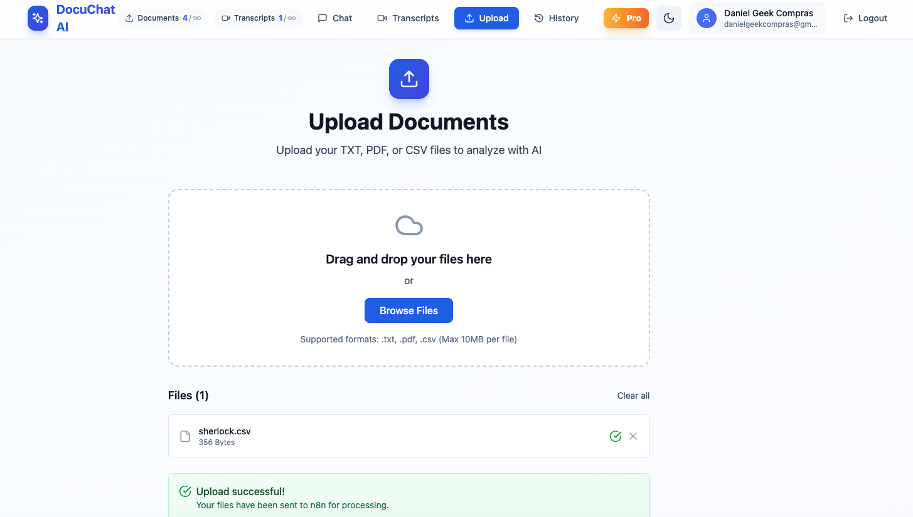
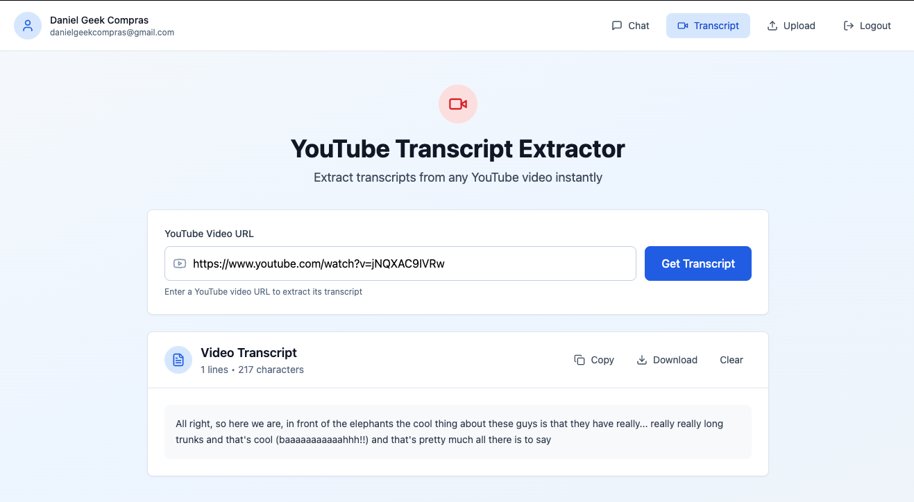
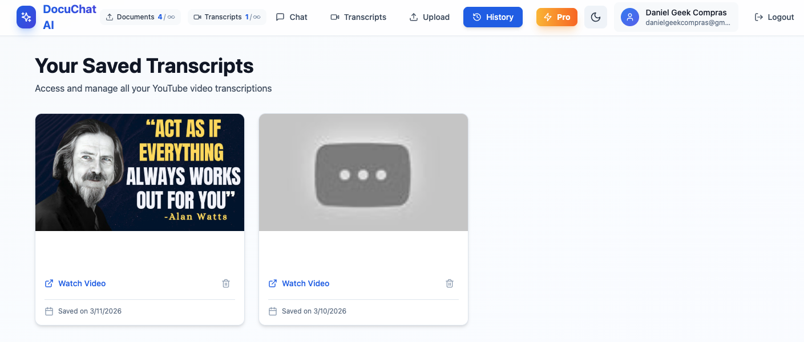
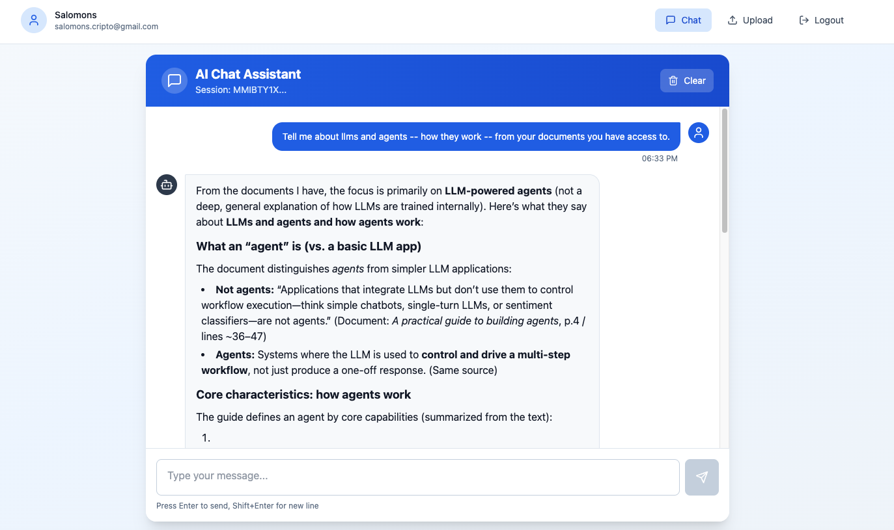
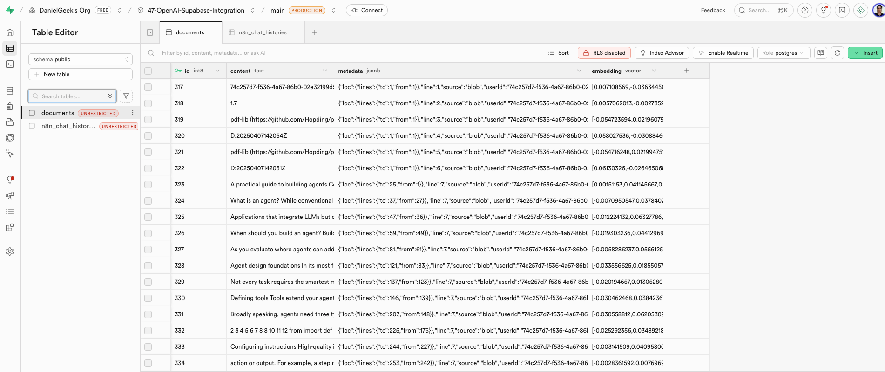

# AI-Powered Full-Stack Applications

A comprehensive full-stack AI application demonstrating real-world integration of OpenAI, Supabase, n8n, Stripe, and modern automation tools. This project showcases the complete development workflow from AI integration to production deployment.

## 🎯 Project Overview

**Project:** AI-Powered Full-Stack Application with Modern Automation Tools  
**Technologies:** Next.js, TypeScript, OpenAI, Supabase, n8n, Stripe, Tailwind CSS  
**Status:** Active Development  
**Last Updated:** March 2026  
**Version:** 1.0.0

## 🚀 What This Project Demonstrates

This project showcases the complete implementation of a production-ready AI application:

- **Full-Stack AI Integration**: End-to-end application with OpenAI, Supabase, and n8n
- **Modern Frontend**: Next.js 14 with TypeScript, Tailwind CSS, and responsive design
- **File Upload & Processing**: Advanced file upload system with n8n workflow integration
- **User Management**: Complete authentication, user limits, and subscription management
- **Production Deployment**: Fully deployed application with Docker and monitoring

## 🏗️ Project Architecture

### Technology Stack



### Core Components

- **Frontend Framework**: Next.js 14 with App Router and TypeScript
- **UI/UX**: Tailwind CSS with custom design system and responsive layouts
- **File Upload System**: Advanced drag-and-drop file uploader with multiple file support
- **n8n Integration**: Webhook-based file processing with error handling
- **Type Safety**: Complete TypeScript implementation with custom types
- **State Management**: Zustand for global state management
- **Authentication**: Supabase Auth with JWT handling
- **Payment System**: Stripe integration for subscription management

## 🛠️ Features & Capabilities

### 1. File Upload System


**Core Features:**

- 📁 **Drag & Drop Interface**: Intuitive file upload with visual feedback
- 🔄 **Multiple File Support**: Upload multiple files simultaneously
- 📄 **File Validation**: Support for TXT, PDF, CSV files (max 10MB)
- 📊 **Real-time Progress**: Live upload status with progress indicators
- ❌ **Error Handling**: Comprehensive error display with server messages
- 🆔 **User Tracking**: Automatic userId generation for file tracking
- 📈 **Upload Statistics**: File size, type, and upload status display

### 2. AI Chat Assistant

**Core Features:**

- 💬 **Real-time Chat**: Interactive AI conversation with markdown support
- 🔄 **Session Management**: Unique session IDs for conversation tracking
- 📝 **Markdown Rendering**: Beautiful formatting for AI responses
- 🎨 **Rich Formatting**: Support for headings, lists, code blocks, and links
- 🔒 **User Authentication**: Secure chat tied to logged-in users
- 🧹 **Clear History**: Easy conversation reset functionality

### 3. YouTube Transcript Extractor

**Core Features:**

- 🎥 **Video URL Input**: Extract transcripts from any YouTube video
- 📄 **Instant Extraction**: Fast transcript retrieval via RapidAPI
- 📋 **Copy to Clipboard**: One-click transcript copying
- 💾 **Download as TXT**: Save transcripts locally
- ✅ **URL Validation**: Smart YouTube URL format detection
- 📊 **Transcript Stats**: Line count and character count display
- 🔒 **User Tracking**: All extractions tied to authenticated users

### Technical Implementation

**File Upload Payload:**

```json
{
  "data": "<File Blob>",
  "filename": "document.pdf",
  "fileType": "application/pdf",
  "fileSize": "2621440",
  "timestamp": "2026-03-05T00:32:15.123Z",
  "userId": "actual-supabase-user-id"
}
```

**Chat Message Payload:**

```json
{
  "chatInput": "Tell me about LLMs and agents",
  "sessionId": "ABC123DEF456",
  "userId": "actual-supabase-user-id"
}
```

**YouTube Transcript Payload:**

```json
{
  "userId": "actual-supabase-user-id",
  "videoUrl": "https://www.youtube.com/watch?v=dQw4w9WgXcQ"
}
```

**Error Handling:**

- Server error parsing (JSON and text responses)
- HTTP status code display
- User-friendly error messages
- Retry capabilities
- URL validation for YouTube links

## 🚀 Getting Started

### Prerequisites

- Node.js 18+ and npm 8+
- OpenAI API key
- Supabase project
- n8n instance
- Stripe account (optional)

### Installation

1. **Clone the repository**

   ```bash
   git clone https://github.com/yourusername/47-OpenAI-Supabase-Integration.git
   cd 47-OpenAI-Supabase-Integration
   ```

2. **Install dependencies**

   ```bash
   npm install
   ```

3. **Set up environment variables**

   ```bash
   cp .env.example .env
   # Edit .env with your API keys and configurations
   ```

4. **Start the development environment**

   ```bash
   npm run dev
   ```

### Environment Configuration

Create a `.env` file with the following variables:

```env
# OpenAI Configuration
OPENAI_API_KEY=your_openai_api_key_here
OPENAI_MODEL=gpt-4-turbo-preview

# Supabase Configuration
SUPABASE_URL=your_supabase_project_url
SUPABASE_ANON_KEY=your_supabase_anon_key
SUPABASE_SERVICE_ROLE_KEY=your_supabase_service_role_key

# Stripe Configuration
STRIPE_SECRET_KEY=sk_test_your_stripe_secret_key
STRIPE_PUBLISHABLE_KEY=pk_test_your_stripe_publishable_key
STRIPE_WEBHOOK_SECRET=whsec_your_webhook_secret

# n8n Configuration
VITE_N8N_UPLOAD_WEBHOOK_URL=your_n8n_file_upload_webhook_url
VITE_N8N_CHAT_WEBHOOK_URL=https://danielgeek.app.n8n.cloud/webhook-test/chat
VITE_N8N_YOUTUBE_WEBHOOK_URL=https://danielgeek.app.n8n.cloud/webhook-test/fetch

# Application Settings
NODE_ENV=development
PORT=3000
FRONTEND_URL=http://localhost:3000

# Vite Environment Variables
VITE_SUPABASE_URL=your_supabase_project_url
VITE_SUPABASE_ANON_KEY=your_supabase_anon_key
VITE_OPENAI_API_KEY=your_openai_api_key
VITE_STRIPE_PUBLISHABLE_KEY=pk_test_your_stripe_publishable_key
VITE_N8N_UPLOAD_WEBHOOK_URL=http://localhost:5678/webhook
VITE_APP_URL=http://localhost:3000
```

## 📁 Project Structure

```text
47-OpenAI-Supabase-Integration/
├── src/
│   ├── components/
│   │   └── FileUploader.tsx      # Advanced file upload component
│   ├── lib/
│   │   ├── supabase.ts           # Supabase client and types
│   │   ├── openai.ts             # OpenAI service integration
│   │   ├── stripe.ts             # Stripe payment service
│   │   ├── n8n.ts                # n8n webhook service
│   │   └── utils.ts              # Utility functions
│   ├── hooks/
│   │   ├── useAuth.ts            # Authentication hook
│   │   ├── useChat.ts            # Chat functionality hook
│   │   └── useSubscription.ts    # Subscription management hook
│   ├── store/
│   │   └── index.ts              # Zustand global state
│   ├── types/
│   │   └── index.ts              # TypeScript type definitions
│   └── vite-env.d.ts             # Vite environment types
├── assets/
│   ├── sherlock.txt              # Sample text data
│   └── workflow.png              # Architecture diagram
├── docs/                         # Documentation
├── examples/                     # Usage examples
├── tests/                        # Test files
├── package.json                  # Dependencies and scripts
├── tailwind.config.js            # Tailwind CSS configuration
├── tsconfig.json                 # TypeScript configuration
└── README.md                     # This file
```

## 🔧 Technical Implementation

### File Uploader Component

The `FileUploader.tsx` component implements a comprehensive file upload system:

**Key Features:**

- Drag-and-drop interface with visual feedback
- Multiple file support with individual status tracking
- File validation (type, size, format)
- Real-time upload progress
- Comprehensive error handling
- Automatic userId generation
- Responsive design with Tailwind CSS

**Core Functions:**

```typescript
// File validation
const validateFile = (file: File): string | null => {
  const extension = '.' + file.name.split('.').pop()?.toLowerCase();
  if (!ALLOWED_TYPES.includes(extension)) {
    return `Invalid file type. Allowed types: ${ALLOWED_TYPES.join(', ')}`;
  }
  if (file.size > MAX_FILE_SIZE) {
    return `File size exceeds 10MB limit`;
  }
  return null;
};

// Upload with error handling
const uploadFile = async (uploadedFile: UploadedFile) => {
  try {
    const formData = new FormData();
    formData.append('data', uploadedFile.file);
    formData.append('filename', uploadedFile.file.name);
    formData.append('fileType', uploadedFile.file.type);
    formData.append('fileSize', uploadedFile.file.size.toString());
    formData.append('timestamp', new Date().toISOString());
    formData.append('userId', 'USR' + Math.random().toString(36).substr(2, 9).toUpperCase());

    const response = await fetch(N8N_UPLOAD_WEBHOOK_URL, {
      method: 'POST',
      body: formData,
    });

    if (!response.ok) {
      // Advanced error parsing
      let errorMessage = `Upload failed (${response.status} ${response.statusText})`;
      
      try {
        const errorData = await response.json();
        if (errorData.message) {
          errorMessage = `Error ${response.status}: ${errorData.message}`;
        }
      } catch {
        // Fallback to text
        const errorText = await response.text();
        if (errorText) {
          errorMessage = `Error ${response.status}: ${errorText}`;
        }
      }
      
      throw new Error(errorMessage);
    }
  } catch (error) {
    // Handle and display errors
  }
};
```

### TypeScript Configuration

**Environment Types:**

```typescript
// src/vite-env.d.ts
interface ImportMetaEnv {
  readonly VITE_SUPABASE_URL: string
  readonly VITE_SUPABASE_ANON_KEY: string
  readonly VITE_OPENAI_API_KEY: string
  readonly VITE_STRIPE_PUBLISHABLE_KEY: string
  readonly VITE_N8N_UPLOAD_WEBHOOK_URL: string
  readonly VITE_APP_URL: string
}

interface ImportMeta {
  readonly env: ImportMetaEnv
}
```

**Custom Types:**

```typescript
// src/types/index.ts
export interface UploadedFile {
  file: File
  id: string
  status: 'idle' | 'uploading' | 'success' | 'error'
  error?: string
}

export interface User {
  id: string
  email: string
  full_name: string | null
  avatar_url: string | null
  stripe_customer_id: string | null
  subscription_tier: 'free' | 'pro' | 'enterprise'
  created_at: string
  updated_at: string
}
```

## 📚 Implementation Roadmap

### Phase 1: Foundation & Setup ✅ COMPLETED

- ✅ Next.js 14 with TypeScript setup
- ✅ Tailwind CSS configuration
- ✅ Environment variable management
- ✅ Project structure and organization

### Phase 2: Core Features ✅ COMPLETED

- ✅ Advanced File Uploader component
- ✅ n8n webhook integration
- ✅ Error handling and user feedback
- ✅ TypeScript type safety
- ✅ Responsive design implementation

### Phase 3: Advanced Integration 🚧 IN PROGRESS

- 🔄 Supabase authentication system
- 🔄 OpenAI API integration
- 🔄 Real-time chat interface
- 🔄 Stripe payment processing

### Phase 4: Production Deployment 📋 PLANNED

- 📋 CI/CD pipeline setup
- 📋 Production deployment configuration
- 📋 Monitoring and analytics
- 📋 Performance optimization

## 🎯 Use Cases

### For Developers

- Build AI-powered SaaS applications with file processing
- Implement advanced upload systems with workflow integration
- Create subscription-based AI services with file handling

### For Entrepreneurs

- Launch AI products with document processing capabilities
- Automate business processes with n8n workflows
- Scale with user management and subscription systems

### For Automation Enthusiasts

- Connect multiple AI services through n8n
- Build intelligent file processing workflows
- Process data automatically with real-time feedback

## 🚀 Deployment

### Development Environment

```bash
# Start the development server
npm run dev

# Access the application
# Frontend: http://localhost:3000
```

### Production Deployment

The project is configured for production deployment with:

- **Environment Management**: Separate dev/prod configurations
- **Monitoring**: Built-in error tracking and analytics
- **Scaling**: Horizontal scaling capabilities

## 📊 Monitoring & Analytics

### Key Metrics

- File upload success rates
- Processing time analytics
- User engagement tracking
- Error rate monitoring
- Performance metrics

### Monitoring Tools

- Custom error tracking in FileUploader
- n8n workflow monitoring
- Supabase dashboard
- Stripe analytics

## 🤝 Contributing

1. Fork the repository
2. Create a feature branch (`git checkout -b feature/amazing-feature`)
3. Commit your changes (`git commit -m 'Add amazing feature'`)
4. Push to the branch (`git push origin feature/amazing-feature`)
5. Open a Pull Request

## 📋 Workflow Example

Here's a visual representation of our file processing workflow:










This workflow demonstrates how files are uploaded, processed through n8n, and integrated with AI services for a seamless user experience.

---

**Tags:** #AI #FullStack #NextJS #TypeScript #OpenAI #Supabase #Stripe #n8n #TailwindCSS #FileUpload #WebDevelopment #MachineLearning #Project
