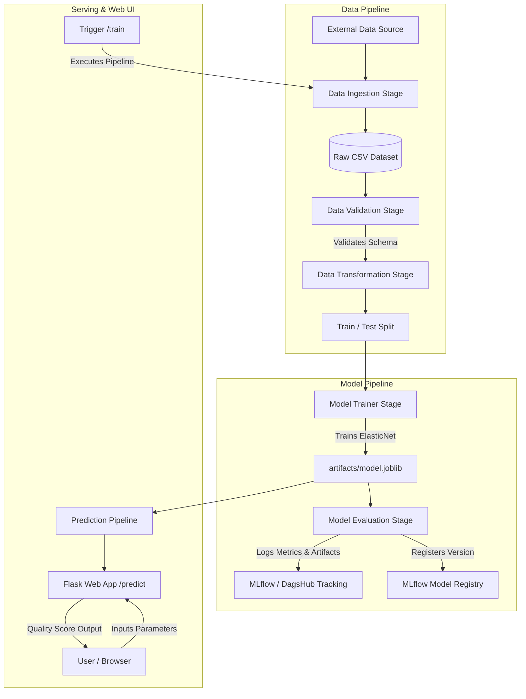

# 23 — End-to-End Data Science & MLOps Pipeline (Wine Quality)

An enterprise-grade, modular **End-to-End Machine Learning and MLOps pipeline** for predicting wine quality based on physicochemical properties. Built following clean architecture design patterns, automated 5-stage pipeline orchestration, remote experiment tracking and model versioning via **MLflow & DagsHub**, and an interactive **Flask Web Interface** for real-time inference and on-demand model retraining.

**GitHub repository:** [`github.com/DanielGeek/data-science-project`](https://github.com/DanielGeek/data-science-project)  
**DagsHub MLflow Tracking:** [`dagshub.com/DanielGeek/data-science-project.mlflow`](https://dagshub.com/DanielGeek/data-science-project.mlflow)

---

## Project Overview

| Component | Technology | Role |
|---|---|---|
| **Problem Type** | Regression | Predicts wine quality score (scale 3–8) |
| **Model** | ElasticNet (Scikit-Learn) | Linear regression combining $L_1$ and $L_2$ regularization |
| **Data Validation** | Schema Enforcer (`schema.yaml`) | Strict column and type validation before transformation |
| **Tracking & Registry** | MLflow + DagsHub | Remote experiment tracking (RMSE, MAE, $R^2$) and model versioning |
| **Pipeline Stages** | Modular Python | 5 independent, reproducible pipeline stages orchestrated via `main.py` |
| **Serving & UI** | Flask | Web interface with input form (`/predict`) and retraining trigger (`/train`) |
| **Configuration** | YAML + Dataclasses | Type-safe configuration management (`ConfigBox`, `ensure_annotations`) |

---

## Project Structure

```
data-science-project/
├── .github/workflows/                 # CI/CD workflows
├── artifacts/                         # Generated pipeline artifacts (data, model, metrics)
│   ├── data_ingestion/                # Downloaded dataset & unzipped files
│   ├── data_validation/               # Schema validation status (status.txt)
│   ├── data_transformation/           # Split datasets (train.csv, test.csv)
│   ├── model_trainer/                 # Trained model artifact (model.joblib)
│   └── model_evaluation/              # Evaluated metrics (metrics.json)
├── config/
│   └── config.yaml                    # File paths and stage configurations
├── params.yaml                        # Model hyperparameters (alpha, l1_ratio)
├── schema.yaml                        # Data columns and type schema validation
├── research/                          # Jupyter notebooks for step-by-step experimentation (01 to 05)
│   ├── 1_data_ingestion.ipynb
│   ├── 2_data_validation.ipynb
│   ├── 3_data_transformation.ipynb
│   ├── 4_model_trainer.ipynb
│   └── 5_model_evaluation.ipynb
├── src/
│   └── datascience/
│       ├── __init__.py                # Custom centralized logging system
│       ├── constants/                 # File path constants (CONFIG_FILE_PATH, PARAMS_FILE_PATH, etc.)
│       ├── utils/                     # Utility helpers (read_yaml, create_directories, save_json)
│       ├── entity/                    # Strongly-typed Dataclasses for stage configurations
│       ├── config/                    # ConfigurationManager loading YAMLs to entities
│       ├── components/                # Core business logic for each stage
│       │   ├── data_ingestion.py
│       │   ├── data_validation.py
│       │   ├── data_transformation.py
│       │   ├── model_trainer.py
│       │   └── model_evaluation.py
│       └── pipeline/                  # Stage pipeline execution wrappers
│           ├── data_ingestion_pipeline.py
│           ├── data_validation_pipeline.py
│           ├── data_transformation_pipeline.py
│           ├── model_trainer_pipeline.py
│           ├── model_evaluation_pipeline.py
│           └── prediction_pipeline.py
├── templates/                         # HTML templates for Flask UI
│   ├── index.html                     # Input form for 11 physicochemical wine features
│   └── results.html                   # Prediction result view
├── app.py                             # Flask web server entry point
├── main.py                            # Master pipeline orchestrator running all 5 stages
├── requirements.txt                   # Pinned project dependencies
└── setup.py                           # Package installation configuration
```

---

## Architecture & Pipeline Flow



---

## 8-Step Modular MLOps Workflow

Every stage in this project follows a strict, repeatable engineering lifecycle:

1. **Update `config/config.yaml`**: Define paths, directories, and stage artifacts.
2. **Update `schema.yaml`**: Define expected column names and data types.
3. **Update `params.yaml`**: Define tunable hyperparameters (e.g. `alpha`, `l1_ratio`).
4. **Update `entity/config_entity.py`**: Create dataclasses with type validation.
5. **Update `config/configuration.py`**: Add getter methods in `ConfigurationManager`.
6. **Update `components/`**: Implement core logic for processing or training.
7. **Update `pipeline/`**: Create the stage execution pipeline class.
8. **Update `main.py`**: Add the stage to the master execution workflow.

---

## Experiment Tracking & Model Registry (MLflow + DagsHub)

All model metrics, parameters, and binary artifacts are tracked remotely on **DagsHub**:

- **Parameters Logged:** `alpha`, `l1_ratio`
- **Metrics Evaluated:** `RMSE`, `MAE`, $R^2$ Score
- **Artifacts Saved:** Model pickle (`model.joblib`), `metrics.json`
- **Model Registry:** Automatic versioning (`ElasticnetModel`, e.g. Version 1, 2, 3...)

---

## Quickstart & Execution

### 1. Environment Setup

```bash
# Create virtual environment
conda create -p venv python=3.10 -y
conda activate venv/

# Install dependencies
pip install -r requirements.txt
```

### 2. Configure Credentials (`.env`)

Create `.env` in the project root:

```env
MLFLOW_TRACKING_URI="https://dagshub.com/DanielGeek/data-science-project.mlflow"
MLFLOW_TRACKING_USERNAME="DanielGeek"
MLFLOW_TRACKING_PASSWORD="your_dagshub_token_or_password"
```

### 3. Run the ML Pipeline

```bash
python main.py
```

### 4. Run the Web Application

```bash
python app.py
```

Navigate to **`http://localhost:8080`** to submit features through the web UI or query `/predict`.
