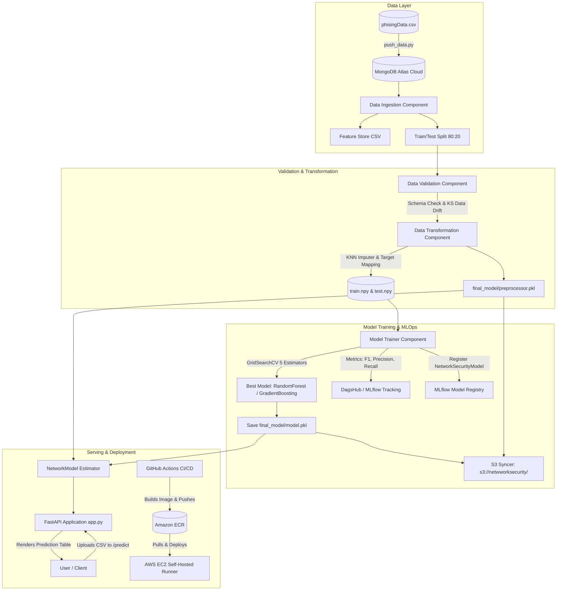

# 🛡️ 24 — Network Security: Phishing Detection & Production MLOps Pipeline

An enterprise-grade, end-to-end **Machine Learning & MLOps system** designed for real-time **Phishing Detection and Network Security analysis**. Built with clean architecture principles, automated multi-stage pipeline orchestration, cloud data ingestion via **MongoDB Atlas**, remote experiment tracking and model registration via **MLflow & DagsHub**, automated artifact backups to **AWS S3**, interactive serving with **FastAPI**, containerization via **Docker**, and full **CI/CD deployment to AWS (ECR + EC2 self-hosted runner)** using **GitHub Actions**.

**GitHub Repository:** [`github.com/DanielGeek/network-security`](https://github.com/DanielGeek/network-security)  
**DagsHub Project & Model Registry:** [`dagshub.com/DanielGeek/network-security`](https://dagshub.com/DanielGeek/network-security)

---

## 📌 Project Overview

| Component               | Technology                         | Role                                                                                                                    |
| -------------------------| ------------------------------------| -------------------------------------------------------------------------------------------------------------------------|
| **Problem Type**        | Binary Classification              | Detects malicious phishing URLs vs. legitimate websites                                                                 |
| **Database**            | MongoDB Atlas                      | Cloud NoSQL database for secure raw data storage and retrieval                                                          |
| **Data Validation**     | Schema Enforcer & Scipy            | Validates 31 feature columns and detects data drift using Kolmogorov-Smirnov (`ks_2samp`)                               |
| **Data Transformation** | Scikit-Learn `KNNImputer`          | Replaces missing values via nearest-neighbor imputation, encodes binary target (-1 to 0)                                |
| **Model Tuning**        | `GridSearchCV` (cv=3)              | Automated hyperparameter tuning across Random Forest, Gradient Boosting, Decision Tree, Logistic Regression, AdaBoost   |
| **Tracking & Registry** | MLflow + DagsHub                   | Remote tracking of F1-score, Precision, Recall, and automated Model Registry (`NetworkSecurityModel`)                   |
| **Cloud Storage Sync**  | AWS S3 (`s3_syncer.py`)            | Automatically syncs timestamped artifacts and final models to AWS S3 bucket                                             |
| **Web Framework**       | FastAPI + Jinja2 + Uvicorn         | High-performance REST API with batch CSV inference (`/predict`), web UI (`table.html`), and training trigger (`/train`) |
| **Containerization**    | Docker (`python:3.10-slim-buster`) | Portable container packaging with AWS CLI integration                                                                   |
| **CI/CD & Deployment**  | GitHub Actions + AWS ECR & EC2     | Automated CI (lint/test), CD (ECR push), and automated deployment to EC2 self-hosted runner                             |

---

## 🚀 Key Features & Highlights

- **Modular Clean Architecture:** Complete separation of concerns: `constant` $\rightarrow$ `entity` $\rightarrow$ `components` $\rightarrow$ `pipeline` $\rightarrow$ `utils` $\rightarrow$ `cloud`.
- **Cloud Database ETL:** Custom extraction tool (`push_data.py`) converts raw tabular security records into JSON documents and batches them into **MongoDB Atlas**.
- **Automated Data Drift Detection:** Compares training and testing distributions using the **Kolmogorov-Smirnov two-sample test (`ks_2samp`)** to identify feature drift, exporting detailed YAML reports.
- **Top-Tier Classification Metrics:**
  - **F1-Score:** `99.17%`
  - **Precision:** `99.01%` (Extremely low false alarms for safe sites)
  - **Recall:** `99.33%` (Virtually zero malicious phishing attacks missed)
- **FastAPI Web Service:** Interactive Swagger documentation at `/docs`, with endpoints to upload CSV batches and view results rendered in a styled HTML table.
- **Cloud S3 Auto-Sync:** Integrated `S3Sync` utility pushes artifacts and trained models to `s3://netwworksecurity/` after each successful pipeline execution.
- **Enterprise CI/CD:** Push-to-main workflow building multi-stage Docker images pushed to **Amazon ECR** and automatically served on **AWS EC2**.

---

## 🏗️ Architecture & Pipeline Flow



---

## 📂 Project Structure

```text
network-security/
├── .github/
│   └── workflows/
│       └── main.yml                   # CI/CD: lint, test, ECR build & push, EC2 deployment
├── Artifacts/                         # Timestamped pipeline artifacts (data, reports, models)
├── Network_Data/
│   └── phisingData.csv                # Raw benchmark dataset (30 security features + target)
├── data_schema/
│   └── schema.yaml                    # Schema definitions (31 columns and types)
├── final_model/                       # Production model binaries
│   ├── model.pkl                      # Best trained estimator
│   └── preprocessor.pkl               # Fitted KNNImputer pipeline
├── networksecurity/
│   ├── cloud/
│   │   └── s3_syncer.py               # AWS S3 sync helper (sync to/from bucket)
│   ├── components/                    # Core business logic
│   │   ├── data_ingestion.py          # MongoDB export & train-test split
│   │   ├── data_validation.py         # Schema verification & KS drift detection
│   │   ├── data_transformation.py     # KNN imputation & target transformation
│   │   └── model_trainer.py           # GridSearchCV benchmark & MLflow logging
│   ├── constant/
│   │   └── training_pipeline/         # Centralized constant definitions & paths
│   ├── entity/
│   │   ├── artifact_entity.py         # Output dataclasses for each pipeline stage
│   │   └── config_entity.py           # Configuration dataclasses for stages
│   ├── exception/
│   │   └── exception.py               # Custom NetworkSecurityException with line tracing
│   ├── logging/
│   │   └── logger.py                  # Custom centralized logger writing to logs/
│   ├── pipeline/
│   │   └── training_pipeline.py       # Master TrainingPipeline orchestrator & S3 sync
│   └── utils/
│       ├── main_utils/utils.py        # File I/O helpers, YAML parser, array loaders
│       └── ml_utils/
│           ├── metric/classification_metric.py  # F1, Precision, Recall calculation
│           └── model/estimator.py     # NetworkModel wrapper combining preprocessor + model
├── prediction_output/
│   └── output.csv                     # Output from batch inference endpoint
├── templates/
│   └── table.html                     # HTML template rendering prediction table
├── Dockerfile                         # Container build definition for production
├── app.py                             # FastAPI web server entry point
├── main.py                            # CLI execution entry point
├── push_data.py                       # ETL script to load raw CSV into MongoDB Atlas
├── requirements.txt                   # Production dependencies
└── setup.py                           # Package installation configuration
```

---

## 📊 Dataset: 30 Cybersecurity Features

The model analyzes 30 domain, URL, and HTML/JS indicators extracted from web pages:

| Category | Features |
|---|---|
| **Address Bar / URL** | `having_IP_Address`, `URL_Length`, `Shortining_Service`, `having_At_Symbol`, `double_slash_redirecting`, `Prefix_Suffix`, `having_Sub_Domain`, `SSLfinal_State`, `Domain_registeration_length`, `port`, `HTTPS_token` |
| **HTML & JavaScript** | `Favicon`, `Request_URL`, `URL_of_Anchor`, `Links_in_tags`, `SFH`, `Submitting_to_email`, `Abnormal_URL`, `Redirect`, `on_mouseover`, `RightClick`, `popUpWidnow`, `Iframe` |
| **Domain & Traffic** | `age_of_domain`, `DNSRecord`, `web_traffic`, `Page_Rank`, `Google_Index`, `Links_pointing_to_page`, `Statistical_report` |
| **Target Variable** | `Result`: `-1` (Phishing) mapped to `0`, `1` (Legitimate) mapped to `1` |

---

## 📈 Evaluation Results (DagsHub & MLflow)

Evaluation metrics achieved on the test dataset:

| Metric | Score | Security Meaning |
|---|:---:|---|
| **F1-Score** | **`99.17%`** | Optimal harmonic balance between Precision and Recall |
| **Precision** | **`99.01%`** | Only 0.99% false alarm rate (safe sites incorrectly flagged) |
| **Recall** | **`99.33%`** | **99.33% of actual phishing attacks intercepted** (only 0.67% bypass rate) |

---

## ⚡ Quickstart & Execution

### 1. Environment Setup

```bash
# Clone the repository
git clone https://github.com/DanielGeek/network-security.git
cd network-security

# Create and activate environment
conda create -p venv python=3.10 -y
conda activate venv/

# Install dependencies
pip install -r requirements.txt
```

### 2. Configure Environment Variables (`.env`)

Create a `.env` file in the project root:

```env
# MongoDB Atlas
MONGODB_URI="mongodb+srv://<username>:<password>@cluster0.gtp2xef.mongodb.net"

# DagsHub / MLflow Tracking
MLFLOW_TRACKING_URI="https://dagshub.com/DanielGeek/network-security.mlflow"
MLFLOW_TRACKING_USERNAME="DanielGeek"
MLFLOW_TRACKING_PASSWORD="your_dagshub_token"

# AWS Configuration (for S3 sync and deployment)
AWS_ACCESS_KEY_ID="your_aws_key"
AWS_SECRET_ACCESS_KEY="your_aws_secret"
AWS_REGION="us-east-1"
```

### 3. Load Data into MongoDB

```bash
python push_data.py
```

### 4. Run the Full Training Pipeline

```bash
python main.py
```
*(Executes Data Ingestion $\rightarrow$ Data Validation $\rightarrow$ Data Transformation $\rightarrow$ Model Training $\rightarrow$ MLflow Logging $\rightarrow$ AWS S3 Sync)*

### 5. Run the FastAPI Web Application

```bash
uvicorn app:app --reload
```
- Open Swagger UI: **`http://localhost:8000/docs`**
- Test batch prediction via `POST /predict` by uploading a CSV file.
- Trigger pipeline execution via `GET /train`.

---

## 🐳 Docker & CI/CD Deployment

### Run Locally with Docker
```bash
docker build -t networksecurity:latest .
docker run -p 8080:8080 --env-file .env networksecurity:latest
```

### GitHub Actions CI/CD Architecture
The `.github/workflows/main.yml` pipeline triggers on every push to `main`:
1. **Continuous Integration:** Checks out repository, lints code, and runs tests.
2. **Continuous Delivery:** Authenticates to AWS via secrets, builds Docker image, and tags/pushes to **Amazon ECR**.
3. **Continuous Deployment:** On an AWS EC2 self-hosted runner, pulls the latest ECR image, stops any running container, and deploys the new version exposed on port 8080.

---

## 👤 Author

- **Daniel Ángel** — [@DanielGeek](https://github.com/DanielGeek)
